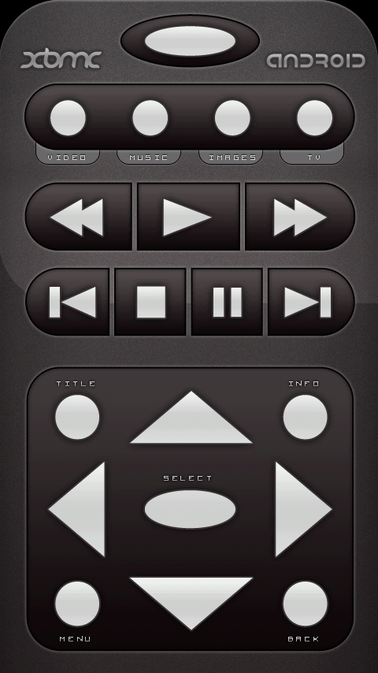

node-remote is a simple web server/webpage pair that can be used (especially on
mobile phones) as a remote control for video playing applications (running under
X11).

The software can (in principle) use different skins for the remote controls and
different video players can be supported. At the moment, the [android xbmc remote
control](https://code.google.com/p/android-xbmcremote/) skin is used and the
keys are designed for [omxplayer](https://github.com/huceke/omxplayer).

RUNNING THE SERVER
Start the server with the command node remote-server.js. Note you have to run
this command from within the display that you want to be controlling, not a
remote session.

Then just have your client browse to port 8000 on the server. In contrast to
other versions of this software, the client does not need support for websockets
and on the other hand, remote controlling of the mouse cursor is not supported.
